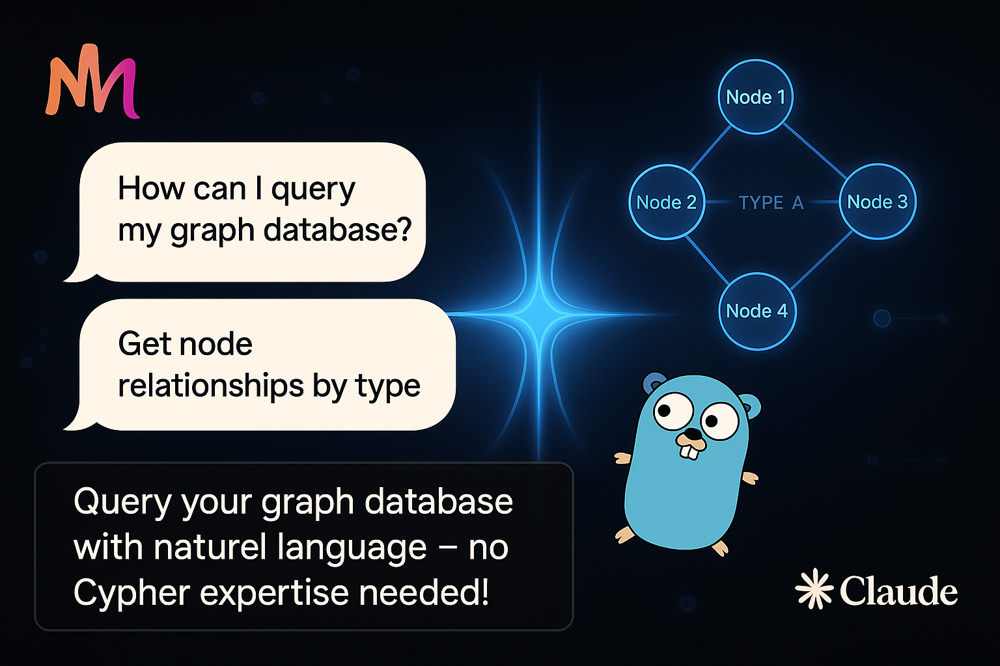

# Memgraph MCP Server



A Model Control Protocol (MCP) server for Memgraph databases that allows Claude to interact with your Memgraph graph databases.

## Using with Claude Code

The easiest way to use this server with Claude Code:

```bash
# Generate MCP config and add it to Claude
JSON=$(memgraph-mcp-server --json --connection-uri 'bolt://localhost:7687') \
&& claude mcp add-json "$JSON"
```

## Installation

### Using Homebrew

```bash
# Add the tap
brew tap mgorunuch/memgraph-mcp-server https://github.com/mgorunuch/memgraph-mcp-server

# Install the server
brew install mgorunuch/memgraph-mcp-server/memgraph-mcp-server
```

### Using Go

```bash
# Clone the repository
git clone https://github.com/mgorunuch/memgraph-mcp-server.git

# Build the server
cd memgraph-mcp-server
go build
```

## Setup

There are two ways to use this server:

### 1. Running Directly

1. Set your Memgraph connection parameters as environment variables (optional):

```bash
export MEMGRAPH_URI="bolt://localhost:7687"
export MEMGRAPH_USER="username"
export MEMGRAPH_PASSWORD="password"
```

If not provided, defaults to `bolt://localhost:7687` with no authentication.

2. Launch the server:

```bash
memgraph-mcp-server
```

3. Use with Claude by setting up the MCP connection to this server.

### 2. Using with Claude's MCP Configuration

1. Generate the MCP configuration JSON:

```bash
memgraph-mcp-server --json --connection-uri "bolt://localhost:7687" --username "username" --password "password"
```

This will output a JSON configuration you can use with Claude's MCP tools.

Example output:
```json
{"type":"stdio","command":"/path/to/memgraph-mcp-server","args":["--connection-uri","bolt://localhost:7687","--username","username","--password","password"],"env":{}}
```

2. Copy this JSON output and use it to configure the MCP connection in Claude.

## Command Line Options

* `--version`: Displays version information
* `--json`: Outputs MCP configuration JSON for use with Claude
* `--connection-uri`: Memgraph connection URI (e.g., bolt://localhost:7687)
* `--username`: Memgraph username
* `--password`: Memgraph password

## Security

For safety, potentially destructive queries (DELETE, REMOVE, DROP, CREATE, MERGE, SET) are blocked by default.

To execute these queries, you must explicitly set `unsafe: true` when using the run_query tool.

## Available Tools

### run_query

Executes a Cypher query against Memgraph.

Parameters:
- `query` (required): The Cypher query to execute
- `unsafe` (optional): Set to true to allow potentially unsafe queries

Example:
```
run_query(query="MATCH (n) RETURN n LIMIT 10")
```

### get_schema

Retrieves schema information from the Memgraph database.

Example:
```
get_schema()
```

## Requirements

- Go 1.21 or higher
- Memgraph database (compatible with Bolt protocol)